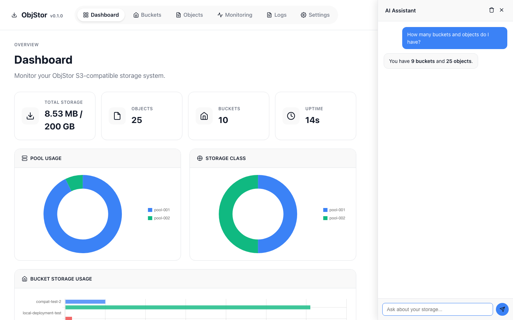
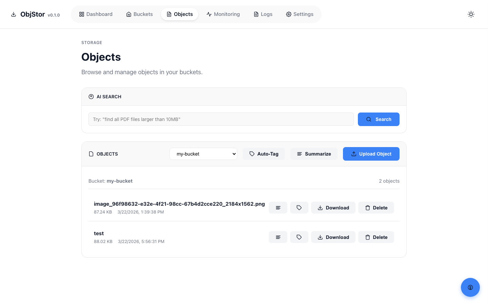
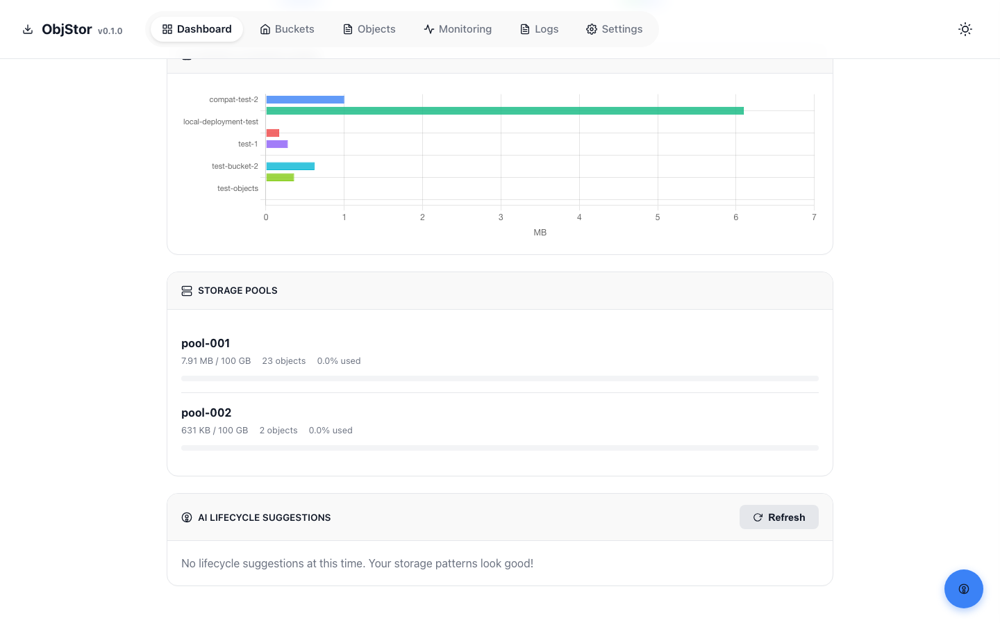
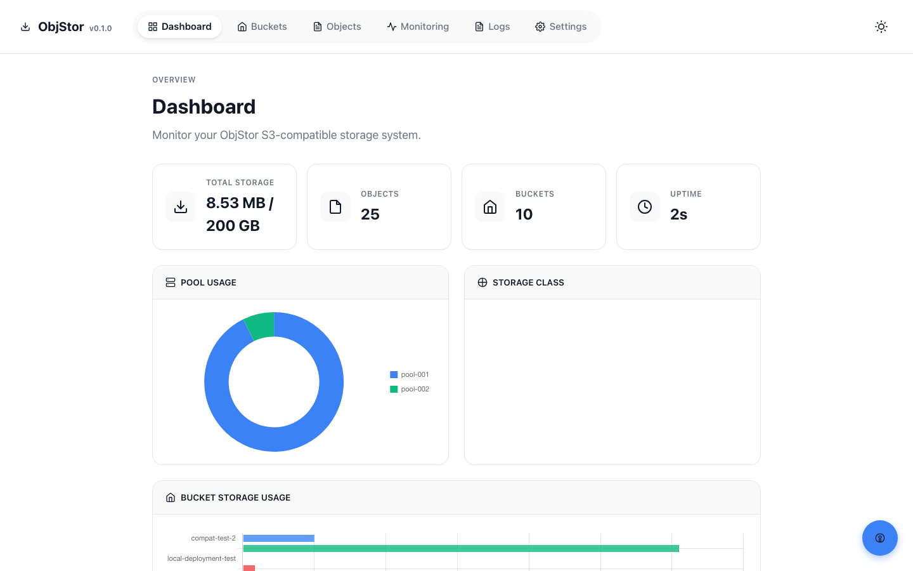

# ObjStor

<p align="center">
  <strong>S3-Compatible Object Storage with Built-in AI Intelligence</strong>
</p>

<p align="center">
  <a href="#quick-start">Quick Start</a> &bull;
  <a href="#ai-features">AI Features</a> &bull;
  <a href="#web-ui">Web UI</a> &bull;
  <a href="#s3-api">S3 API</a> &bull;
  <a href="docs/CONFIGURATION.md">Configuration</a>
</p>

<p align="center">
  
  
  
  
</p>

---

## Highlights

**ObjStor** is a high-performance, S3-compatible object storage system written in Rust. It provides a complete S3 API, multi-pool distributed storage with intelligent load balancing, a modern web dashboard, and **built-in AI capabilities** powered by any OpenAI-compatible LLM.

### Why ObjStor?

| Feature | ObjStor | MinIO | LocalStack |
|---------|---------|-------|-----------|
| Full S3 API | Yes | Yes | Partial |
| Web Dashboard | Built-in | Separate | No |
| AI-Powered Tagging | Built-in | Plugin | No |
| AI Chat Assistant | Built-in | No | No |
| AI Lifecycle Advisor | Built-in | No | No |
| Semantic Search | Built-in | No | No |
| Single Binary | Yes | Yes | Java |
| Language | Rust | Go | Java |

---

## AI Features

ObjStor integrates AI directly into your storage workflow. Connect any OpenAI-compatible LLM (Ollama, vLLM, LM Studio, Xinference, etc.) and unlock intelligent storage management.

### 1. AI Chat Assistant

A slide-out chat panel that understands your storage state. Ask questions in natural language and get context-aware answers.

> "How many objects do I have?" &rarr; "You currently have 10 objects across 3 buckets..."
> "Which bucket uses the most storage?" &rarr; "The `my-bucket` bucket is using 4.2 GB..."



**Features:**
- Context-aware: knows your buckets, objects, pools, and system metrics
- Markdown rendering: code blocks, tables, lists
- Persistent history: chat records survive page refreshes (localStorage)
- Dark/Light theme support

### 2. Smart Auto-Tagging

Upload a file and AI automatically generates relevant tags based on filename, content type, and size.



```bash
# Single object
curl -X POST http://localhost:3020/api/v1/ai/tags \
  -H "Content-Type: application/json" \
  -d '{"bucket":"my-bucket","key":"report-2024.pdf"}'

# Bulk tagging (entire bucket)
curl -X POST http://localhost:3020/api/v1/ai/tags/bulk \
  -H "Content-Type: application/json" \
  -d '{"bucket":"my-bucket"}'
```

**Auto-Tag on Upload**: Enable `Auto-Tag on Upload` in Settings to automatically tag every uploaded object.

### 3. Content Summarization

AI reads and summarizes text files directly from storage.


```bash
# Summarize a single object
curl -X POST http://localhost:3020/api/v1/ai/summarize \
  -H "Content-Type: application/json" \
  -d '{"bucket":"my-bucket","key":"meeting-notes.txt"}'

# Summarize all text objects in a bucket
curl -X POST http://localhost:3020/api/v1/ai/summarize/bulk \
  -H "Content-Type: application/json" \
  -d '{"bucket":"my-bucket"}'
```

### 4. AI Lifecycle Suggestions

AI analyzes your storage patterns (object age, access frequency, size distribution) and recommends lifecycle rules.



```bash
curl http://localhost:3020/api/v1/ai/lifecycle-suggestions
```

Returns suggested rules like:
- *Transition objects with prefix `logs/` older than 90 days to GLACIER tier*
- *Delete temporary objects with prefix `tmp/` after 7 days*

### 5. Semantic Search

Search objects using natural language instead of exact key matches.

```bash
curl -X POST http://localhost:3020/api/v1/ai/search \
  -H "Content-Type: application/json" \
  -d '{"query":"PDF files uploaded last week larger than 10MB"}'
```

### AI Setup

Configure your LLM in **Settings &rarr; AI Configuration**:

1. Enable AI features
2. Set the API endpoint (e.g., `http://127.0.0.1:7001` for Ollama)
3. Enter your API key
4. Select a model

Or edit `data/config/objstor.json`:

```json
{
  "ai": {
    "enabled": true,
    "api_endpoint": "http://127.0.0.1:7001",
    "api_key": "your-key",
    "model": "llama3",
    "max_tokens": 1024,
    "timeout_secs": 15,
    "auto_tag": false
  }
}
```

---

## Web UI

A modern, responsive dashboard with real-time updates.



| Page | Description |
|------|-------------|
| **Dashboard** | Storage usage charts, pool status, system metrics |
| **Buckets** | Create, delete, browse buckets with metadata |
| **Objects** | Upload, download, delete, tag, and summarize objects |
| **Monitoring** | CPU, memory, disk I/O charts with live updates |
| **Logs** | Real-time log streaming with color-coded levels |
| **Settings** | Server config, AI config, access keys management |

**UI Features:**
- Dark/Light theme toggle
- Real-time WebSocket updates (metrics every 5s, logs every 2s)
- Toast notifications and confirmation modals
- IME-friendly input fields (Chinese, Japanese, etc.)
- Responsive layout that shifts when AI chat panel opens

---

## Quick Start

### Docker

```bash
git clone https://github.com/yong-huang/objstor.git
cd objstor
docker-compose up -d
open http://localhost:3020
```

### From Source

```bash
git clone https://github.com/yong-huang/objstor.git
cd objstor
cargo build --release
./target/release/objstor
```

Open `http://localhost:3020` in your browser.

### Default Credentials

```
Access Key ID: test-access-key
Secret Key:    test-secret-key
Region:        us-east-1
```

---

## S3 API

ObjStor implements the core S3 API, fully compatible with AWS SDKs, boto3, rclone, and other S3 clients.

### Bucket Operations

| API | Method | Endpoint |
|-----|--------|----------|
| ListBuckets | GET | / |
| CreateBucket | PUT | /{bucket} |
| DeleteBucket | DELETE | /{bucket} |
| HeadBucket | HEAD | /{bucket} |

### Object Operations

| API | Method | Endpoint |
|-----|--------|----------|
| PutObject | PUT | /{bucket}/{key} |
| GetObject | GET | /{bucket}/{key} |
| DeleteObject | DELETE | /{bucket}/{key} |
| CopyObject | PUT | /{bucket}/{key} |
| HeadObject | HEAD | /{bucket}/{key} |

### Multipart Upload

| API | Method | Endpoint |
|-----|--------|----------|
| CreateMultipartUpload | POST | /{bucket}/{key}?uploads |
| UploadPart | PUT | /{bucket}/{key}?partNumber&uploadId |
| CompleteMultipartUpload | POST | /{bucket}/{key}?uploadId |
| AbortMultipartUpload | DELETE | /{bucket}/{key}?uploadId |
| ListParts | GET | /{bucket}/{key}?uploadId |

### Additional Features

- **Versioning**: GetBucketVersioning, PutBucketVersioning, ListObjectVersions
- **Tagging**: Put/Get/Delete Object Tagging
- **ACLs**: Put/Get Object ACL
- **Presigned URLs**: Generate time-limited download URLs
- **AWS4 Authentication**: Full HMAC-SHA256 signature verification

### Example with AWS CLI

```bash
export AWS_ACCESS_KEY_ID=test-access-key
export AWS_SECRET_ACCESS_KEY=test-secret-key

aws s3 ls --endpoint-url http://localhost:3020
aws s3 mb s3://demo --endpoint-url http://localhost:3020
aws s3 cp file.txt s3://demo/ --endpoint-url http://localhost:3020
```

### Example with Python (boto3)

```python
import boto3

s3 = boto3.client('s3',
    endpoint_url='http://localhost:3020',
    aws_access_key_id='test-access-key',
    aws_secret_access_key='test-secret-key',
    region_name='us-east-1')

s3.create_bucket(Bucket='demo')
s3.upload_file('file.txt', 'demo', 'file.txt')
```

---

## Storage Architecture

### Multi-Pool Distributed Storage

Objects are distributed across configurable storage pools with intelligent scheduling:

```
┌──────────┐    ┌──────────┐    ┌──────────┐
│ Pool 001  │    │ Pool 002  │    │ Pool 003  │
│  (SSD)   │    │  (HDD)   │    │  (SSD)   │
└────┬─────┘    └────┬─────┘    └────┬─────┘
     │               │               │
     └───────────────┼───────────────┘
                     │
            ┌────────▼────────┐
            │  Load Balancer   │
            │  - Least Loaded │
            │  - Round Robin  │
            │  - Adaptive     │
            └─────────────────┘
```

### Content-Addressable Storage

Objects are stored using SHA256 content hashing:

```
data/pools/pool-001/objects/
└── a3/                    # First 2 bytes of hash
    └── a3f5b8c2.../        # Full hash
        ├── data            # Object content
        └── meta.json       # Object metadata
```

### Scheduler Strategies

| Strategy | Description |
|----------|-------------|
| **Least Loaded** | Selects the pool with the lowest usage ratio |
| **Weighted Round Robin** | Distributes based on available space ratio |
| **Adaptive** | Considers I/O metrics, network, and object size |
| **Consistent Hash** | Deterministic pool assignment based on object key |

---

## Admin API

All AI and management endpoints are available under `/api/v1/`:

| Endpoint | Method | Description |
|----------|--------|-------------|
| `/api/v1/metrics` | GET | Storage and request metrics |
| `/api/v1/system` | GET | CPU, memory, disk metrics |
| `/api/v1/buckets` | GET | List all buckets |
| `/api/v1/objects` | GET | List objects (`?bucket=name`) |
| `/api/v1/config` | GET/PUT | Server and storage configuration |
| `/api/v1/access-keys` | CRUD | Access key management |
| `/api/v1/ai/chat` | POST | AI chat assistant |
| `/api/v1/ai/search` | POST | Semantic search |
| `/api/v1/ai/tags` | POST | Generate tags for an object |
| `/api/v1/ai/tags/bulk` | POST | Bulk tag generation |
| `/api/v1/ai/summarize` | POST | Summarize a text object |
| `/api/v1/ai/summarize/bulk` | POST | Bulk summarization |
| `/api/v1/ai/lifecycle-suggestions` | GET | AI lifecycle advice |
| `/api/v1/health` | GET | Health check |

---

## Configuration

Configuration is managed via `data/config/objstor.json`. Auto-created with defaults on first run.

Key settings:

```json
{
  "server": {
    "port": 3020,
    "log_level": "info"
  },
  "storage": {
    "pools": [
      { "id": "pool-001", "capacity": 107374182400, "max_objects": 1000000 }
    ],
    "scheduler": { "strategy": "least_loaded" }
  },
  "ai": {
    "enabled": true,
    "api_endpoint": "http://127.0.0.1:7001",
    "model": "llama3",
    "auto_tag": false
  }
}
```

See [docs/CONFIGURATION.md](docs/CONFIGURATION.md) for the full reference.

---

## Technical Details

| Feature | Implementation |
|---------|---------------|
| Web Framework | [Axum](https://github.com/tokio-rs/axum) |
| Async Runtime | [Tokio](https://tokio.rs) |
| Database | [SQLite](https://rusqlite.org) (WAL mode) |
| LLM Client | [Hyper](https://hyper.rs) (direct TCP) |
| Logging | [tracing](https://tracing.rs) with daily rotation |
| Content Hashing | SHA256 (built-in) |
| Encryption | AES-GCM (SSE-S3, SSE-C) |
| ETag | MD5 |
| UI Framework | Vanilla JS + [Chart.js](https://www.chartjs.org/) |

---

## Documentation

| Document | Description |
|----------|-------------|
| [Build Guide](docs/deployment/build.md) | Build and installation |
| [Docker Deployment](docs/deployment/docker.md) | Docker deployment |
| [Local Deployment](docs/deployment/local.md) | Native binary deployment |
| [Configuration](docs/CONFIGURATION.md) | Full configuration reference |
| [Pool Guide](docs/POOL_CONFIG_GUIDE.md) | Storage pool configuration |
| [Architecture](docs/structure.md) | Project structure and modules |
| [Dev Guide](CLAUDE.md) | AI assistant development guide |

---

## License

MIT License - see [LICENSE](LICENSE) file for details.
